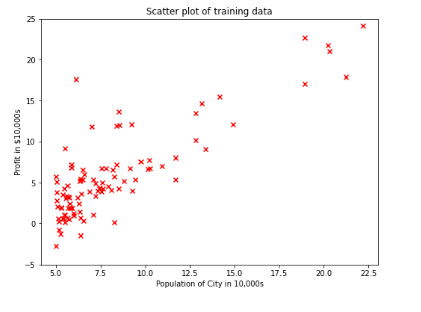
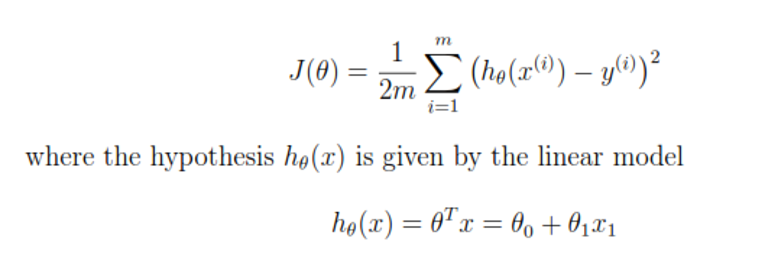
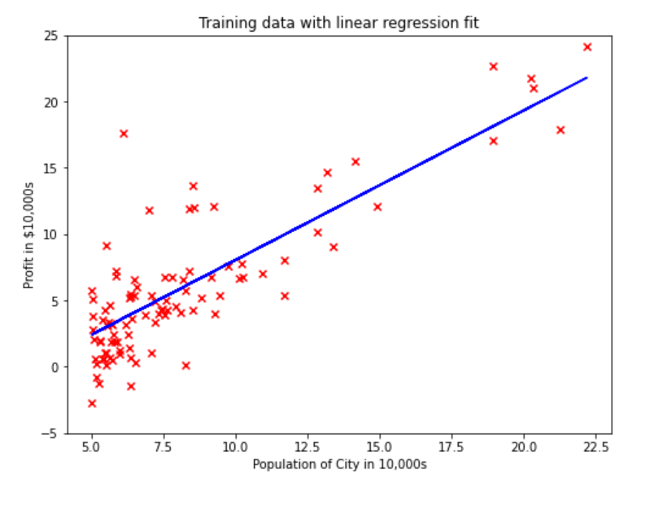
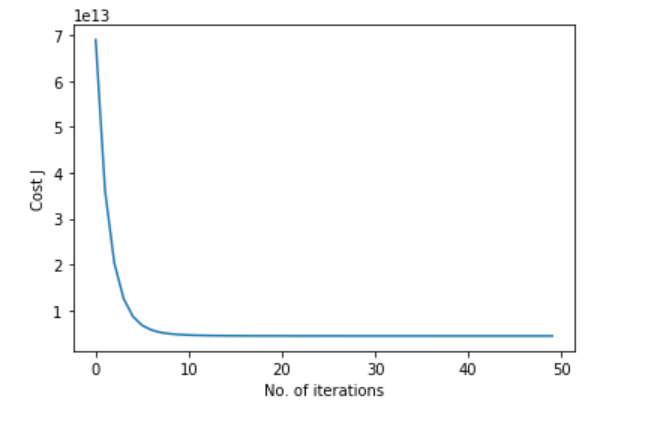

# Linear-Regression
This prject implements Linear Regression with One and Multiple variables in Python.

## Part I: Linear Regression with One Variable
This part implements linear regression with one variable in ``Linear Regression with One Variable.ipynb`` file to predict profits for a bakery franchise on the basis of 
population. The file ``Data/ex1data1.txt`` contains the dataset for this linear 
regression problem. The first column is the population of a city and the second column is the profit of an outlet in that city. A negative value for profit indicates a loss.  
To understand the dataset, scatter plot is used to visualize the data. Population of the city is the independent variable while Profit is the dependent variable to be pridicted using
Linear Regression. The visualization of training data is shown below.

The objective of linear regression is to minimize the cost function given below.

After implementing gradient descent algorithm and training the model, the plot demonstrating the best line fit is shown below.

## Part II: Linear Regression with Multiple Variables
This part implements linear regression with multiple variables to predict the prices of houses on the basis of size of the house and number of bedrooms
collect information on recent houses sold and make a model of housing prices. The file ``Data/ex1data2.txt`` contains a training set of housing prices in a city. 
The first column is the size of the house (in square feet), the second column is the number of bedrooms, and the third column is the price of the house.

The gradient descent for multiple variables is same as that for a univariate regression problem with the only difference of multiple features. The hypothesis function 
and the batch gradient descent update rule remain unchanged. The alternate to gradient descent is the Normal Equation for Linear Regression shown below.

We tried out different learning rates for the dataset and found a learning rate that converges quickly. The cost function should decrease with the number of 
iterations as illustrated below.

